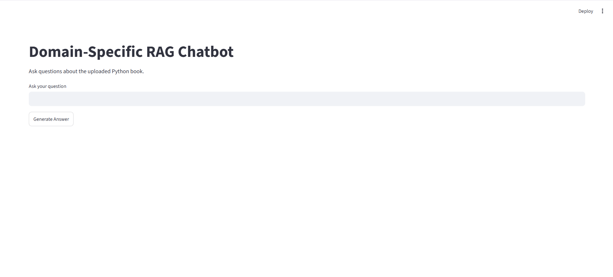
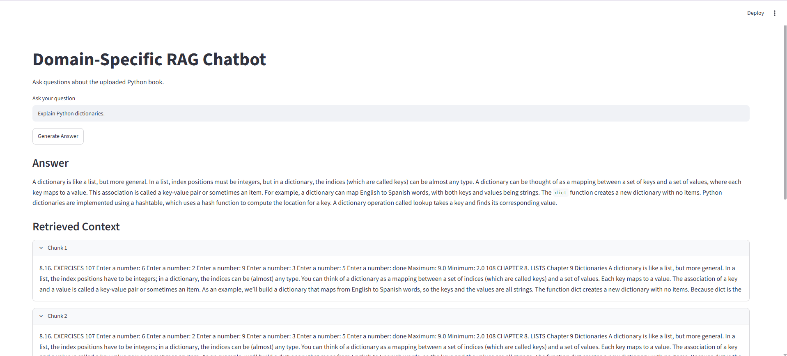
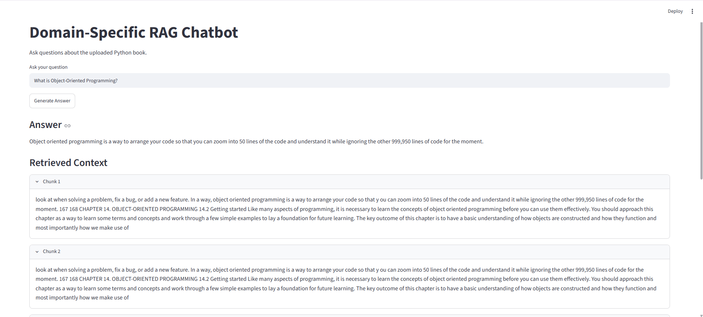
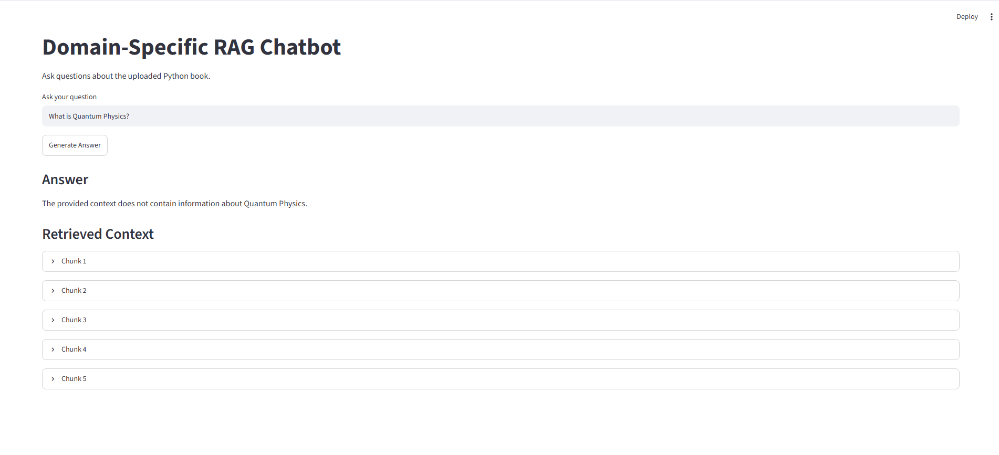

# 📚 Domain-Specific RAG Chatbot using ChromaDB & Google Gemini


A **Retrieval-Augmented Generation (RAG)** chatbot that answers questions from a custom PDF knowledge base using **semantic search**, **Sentence Transformers**, **ChromaDB**, **Google Gemini**, and **Streamlit**.

Instead of relying solely on the Large Language Model's internal knowledge, the chatbot retrieves the most relevant information from an uploaded document before generating an answer, resulting in more reliable and context-aware responses.

---

# 📖 Project Overview

Large Language Models are powerful but cannot reliably answer questions from private or custom documents.

This project implements a **Retrieval-Augmented Generation (RAG)** pipeline that enables users to interact with a custom PDF document through natural language.

The chatbot:

- Extracts text from a PDF
- Splits the text into semantic chunks
- Converts chunks into vector embeddings
- Stores embeddings inside ChromaDB
- Retrieves the most relevant chunks
- Uses Google Gemini to generate grounded responses

---

# ✨ Features

- 📄 Reads custom PDF documents
- ✂️ Intelligent text chunking
- 🧠 Semantic embeddings using Sentence Transformers
- 🗂️ Chroma Vector Database
- 🔍 Top-5 semantic retrieval
- 🤖 Google Gemini 2.5 Flash integration
- 💬 Streamlit web interface
- 📚 Context-aware answers
- 🚫 Refuses questions outside the uploaded document

---

# 🏗️ System Architecture

```
                 PDF Document
                       │
                       ▼
               Text Extraction
                       │
                       ▼
                 Text Chunking
                       │
                       ▼
        Sentence Transformer Embeddings
                       │
                       ▼
              Chroma Vector Database
                       │
             User Question (Query)
                       │
                       ▼
          Similarity Search (Top-5)
                       │
                       ▼
      Retrieved Context + User Query
                       │
                       ▼
            Google Gemini 2.5 Flash
                       │
                       ▼
                Final AI Response
```

---

# 🛠️ Tech Stack

- Python
- Streamlit
- Google Gemini API
- ChromaDB
- Sentence Transformers
- LangChain
- PyPDF
- Python Dotenv

---

# 📚 Knowledge Corpus

The chatbot uses a **publicly available Python programming reference book** as its knowledge source.

### Corpus Statistics

| Metric | Value |
|---------|------:|
| Total Pages | 241 |
| Total Characters | 430,998 |
| Total Chunks | 715 |
| Chunk Size | 800 |
| Chunk Overlap | 200 |

---

# 📸 Project Screenshots

## Home Page



---

## Question 1 – Python Dictionaries



---

## Question 2 – Object-Oriented Programming



---

## Question 3 – Out-of-Scope Query



---

# 💬 Demo Questions

### Example 1

**Question**

```
Explain Python dictionaries.
```

**Result**

The chatbot retrieves the relevant section from the uploaded PDF and generates a grounded explanation.

---

### Example 2

**Question**

```
What is Object-Oriented Programming?
```

**Result**

The chatbot successfully retrieves the corresponding chapter and answers using the retrieved context.

---

### Example 3

**Question**

```
What is Quantum Physics?
```

**Expected Result**

```
I couldn't find this information in the uploaded document.
```

This demonstrates that the chatbot avoids hallucinating answers for topics outside the uploaded knowledge base.

---

# 📂 Project Structure

```
Domain-Specific-RAG-Chatbot/

│── app.py
│── rag_chatbot.ipynb
│── requirements.txt
│── README.md
│── RESULTS.md
│── .gitignore
│── .env
│── chroma_db/
│── data/
│   └── pythonlearn.pdf
│── images/
│   ├── home_page.png
│   ├── demo_dictionary.png
│   ├── demo_oop.png
│   └── out_of_scope.png
```

---

# ⚙️ Installation

Clone the repository

```bash
git clone https://github.com/VaishaliVMoolya/Domain-Specific-RAG-Chatbot.git
```

Navigate to the project

```bash
cd Domain-Specific-RAG-Chatbot
```

Create a virtual environment

```bash
python -m venv venv
```

Activate the environment

Windows

```bash
venv\Scripts\activate
```

Install dependencies

```bash
pip install -r requirements.txt
```

Create a `.env` file

```
GEMINI_API_KEY=YOUR_API_KEY
```

Run the application

```bash
streamlit run app.py
```

---

# 📊 Results

- Successfully processed a 241-page PDF
- Generated 715 semantic chunks
- Created vector embeddings using Sentence Transformers
- Stored embeddings in ChromaDB
- Retrieved relevant context using semantic similarity search
- Generated grounded responses with Google Gemini
- Successfully demonstrated Retrieval-Augmented Generation (RAG)

Detailed project results are available in **RESULTS.md**.

---

# 🚀 Future Improvements

- Support multiple PDF documents
- Upload PDFs directly from the interface
- Conversation history
- Source highlighting with page numbers
- Multi-document retrieval
- Better UI/UX
- Docker deployment

---

# 💭 Reflection

This project provided valuable hands-on experience in building a Retrieval-Augmented Generation (RAG) system using modern AI technologies. It demonstrated how semantic embeddings, vector databases, and Large Language Models can work together to answer questions from a custom knowledge source while reducing hallucinations. The project also strengthened practical skills in document preprocessing, vector search, prompt engineering, and deploying AI applications with Streamlit.

---

# 👩‍💻 Author

**Vaishali Vittal Moolya**

Built as part of an AI/ML Internship Project on Retrieval-Augmented Generation (RAG).